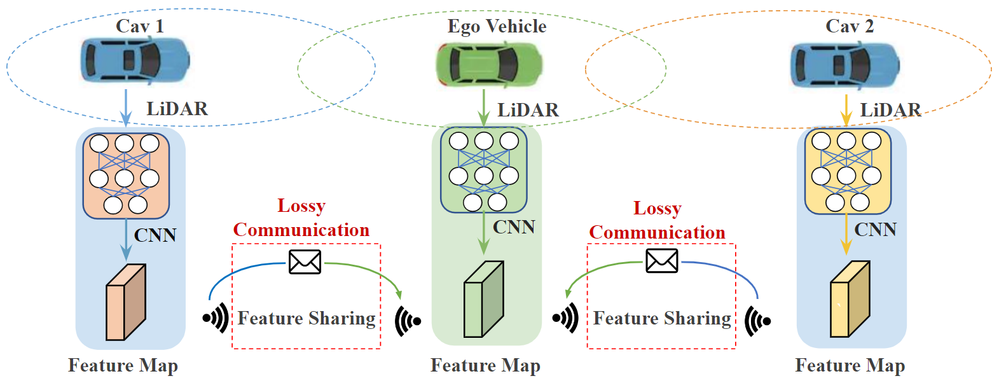
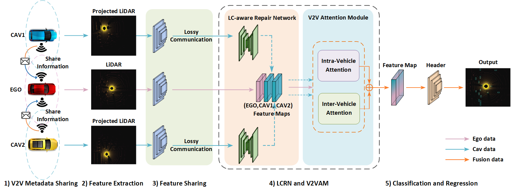

# Learning for Vehicle-to-Vehicle Cooperative Perception under Lossy Communication


[](https://opensource.org/licenses/MIT) 

This [paper (TIV 2023)](https://ieeexplore.ieee.org/document/10077757) proposes the first research on V2V cooperative perception (point cloud-based 3D object detection) under lossy communication and study the side effect of lossy communication on cooperative perception, specifically the impact on detection performance. This project is based on the [OpenCOOD](https://github.com/DerrickXuNu/OpenCOOD?tab=readme-ov-file).


<p align="center">

</p>

## Architecture of the Proposed Framework:

The architecture of  LC-aware feature fusion framework. The proposed model includes five components: 
- V2V Metadata Sharing.
-  LiDAR Feature Extraction.
-  Feature Sharing.
-  **LC-aware Repair Network (LCRN) and V2V Attention Module (V2VAM)**: LC-Aware Repair Network for recovering the intermediate feature map in lossy communication by using tensor-wise filtering, and V2V Attention module for iterative inter-vehicle as well as intra-vehicle feature fusion utilizing attention mechanisms.
-  Classification and Regression header.


<p align="center">

</p>


## Data Downloading
All the data can be downloaded from [google drive](https://drive.google.com/drive/folders/1dkDeHlwOVbmgXcDazZvO6TFEZ6V_7WUu). If you have a good internet, you can directly
download the complete large zip file such as `train.zip`. In case you suffer from downloading large files, we also split each data set into small chunks, which can be found 
in the directory ending with `_chunks`, such as `train_chunks`. After downloading, please run the following command to each set to merge those chunks together:
```python
cat train.zip.part* > train.zip
unzip train.zip
```

## Installation
Please refer to [data introduction](https://opencood.readthedocs.io/en/latest/md_files/data_intro.html)
and [installation](https://opencood.readthedocs.io/en/latest/md_files/installation.html) guide to prepare
data and install OpenCOOD. To see more details of OPV2V data, please check [this website.](https://mobility-lab.seas.ucla.edu/opv2v/)

## Quick Start


### V2VAM Training  

OpenCOOD uses yaml file to configure all the parameters for training. To train your own model
from scratch or a continued checkpoint, run the following commonds:
```python
python opencood/tools/train.py --hypes_yaml ${CONFIG_FILE} [--model_dir  ${CHECKPOINT_FOLDER} --half]
```
Arguments Explanation:
- `hypes_yaml`: the path of the training configuration file, e.g. `opencood/hypes_yaml/second_early_fusion.yaml`, meaning you want to train
an early fusion model which utilizes SECOND as the backbone. See [Tutorial 1: Config System](https://opencood.readthedocs.io/en/latest/md_files/config_tutorial.html) to learn more about the rules of the yaml files.
- `model_dir` (optional) : the path of the checkpoints. This is used to fine-tune the trained models. When the `model_dir` is
given, the trainer will discard the `hypes_yaml` and load the `config.yaml` in the checkpoint folder.
- `half` (optional): If set, the model will be trained with half precision. It cannot be set with multi-gpu training togetger.


### V2VAM Testing

### V2VAM and LCRN Training 

OpenCOOD uses yaml file to configure all the parameters for training. To train your own model
from scratch or a continued checkpoint, run the following commonds:
```python
python opencood/tools/train.py --hypes_yaml ${CONFIG_FILE} [--model_dir  ${CHECKPOINT_FOLDER} --half]
```
Arguments Explanation:
- `hypes_yaml`: the path of the training configuration file, e.g. `opencood/hypes_yaml/second_early_fusion.yaml`, meaning you want to train
an early fusion model which utilizes SECOND as the backbone. See [Tutorial 1: Config System](https://opencood.readthedocs.io/en/latest/md_files/config_tutorial.html) to learn more about the rules of the yaml files.
- `model_dir` (optional) : the path of the checkpoints. This is used to fine-tune the trained models. When the `model_dir` is
given, the trainer will discard the `hypes_yaml` and load the `config.yaml` in the checkpoint folder.
- `half` (optional): If set, the model will be trained with half precision. It cannot be set with multi-gpu training togetger.


### V2VAM and LCRN Testing


### Test the model
Before you run the following command, first make sure the `validation_dir` in config.yaml under your checkpoint folder
refers to the testing dataset path, e.g. `opv2v_data_dumping/test`.

```python
python opencood/tools/inference.py --model_dir ${CHECKPOINT_FOLDER} --fusion_method ${FUSION_STRATEGY} [--show_vis] [--show_sequence]
```
Arguments Explanation:
- `model_dir`: the path to your saved model.
- `fusion_method`: indicate the fusion strategy, currently support 'early', 'late', and 'intermediate'.
- `show_vis`: whether to visualize the detection overlay with point cloud.
- `show_sequence` : the detection results will visualized in a video stream. It can NOT be set with `show_vis` at the same time.
- `global_sort_detections`: whether to globally sort detections by confidence score. If set to True, it is the mainstream AP computing method, but would increase the tolerance for FP (False Positives). **OPV2V paper does not perform the global sort.** Please choose the consistent AP calculation method in your paper for fair comparison.

The evaluation results  will be dumped in the model directory. 

## Benchmark and model zoo

**Note**: 
* We suggest using **PointPillar** as the backbone when you are creating your method and try to compare with
our benchmark, as we implement most of the SOTA methods with this backbone only.
* We assume the transimssion rate is 27Mbp/s. Considering the frequency of LiDAR is 10Hz, the 
bandwidth requirement should be less than **2.7Mbp** to avoid severe delay. 


### Results of 3D Detection on OPV2V Testing Set (Default Towns)
| Method       |          Training Data        | Backbone   | Bandwidth (Megabit) <br> before/after compression | Perfect<br> AP@0.5 | Perfect<br>  AP@0.7 | Noisy<br>  AP@0.5 | Noisy<br>  AP@0.7 | Download                                                            |
|--------------|-------------------------------|-------------|-------|------------|----------------|--------------|--------------|----------------------------------------|
| [Attentive Fusion]()    |       Perfect Setting         | PointPillar | 126.8/1.98 |60.6           | 40.2           | 60.6         | 40.2         |                                        |
| V2VAM  |       Perfect Setting         | PointPillar | 126.8/1.98   | 72.7           |62.0           | 54.9         | 30.7         |                                        |
| V2VAM+LCRN |       Perfect Setting         | PointPillar |126.8/1.98| 81.9           | 71.0           | 72.0         | 38.4         |
| [Attentive Fusion]()    |       Lossy Setting         | PointPillar | 126.8/1.98| 60.6           | 40.2           | 60.6         | 40.2         |                                        |
| V2VAM  |       Lossy Setting         | PointPillar | 126.8/1.98| 72.7           | 62.0           | 54.9         | 30.7         |                                        |
| V2VAM+LCRN |       Lossy Setting         | PointPillar | 126.8/1.98 | 81.9           | 71.0           | 72.0         | 38.4         |                                          |


### Results of 3D Detection on OPV2V Testing Set (Culver City)
| Method       |          Training Data        | Backbone   | Bandwidth (Megabit) <br> before/after compression | Perfect<br> AP@0.5 | Perfect<br>  AP@0.7 | Noisy<br>  AP@0.5 | Noisy<br>  AP@0.7 | Download                                                            |
|--------------|-------------------------------|-------------|-------|------------|----------------|--------------|--------------|----------------------------------------|
| [Attentive Fusion]()    |       Perfect Setting         | PointPillar | 126.8/1.98 |60.6           | 40.2           | 60.6         | 40.2         |                                        |
| V2VAM  |       Perfect Setting         | PointPillar | 126.8/1.98   | 72.7           |62.0           | 54.9         | 30.7         |                                        |
| V2VAM+LCRN |       Perfect Setting         | PointPillar |126.8/1.98| 81.9           | 71.0           | 72.0         | 38.4         |
| [Attentive Fusion]()    |       Lossy Setting         | PointPillar | 126.8/1.98| 60.6           | 40.2           | 60.6         | 40.2         |                                        |
| V2VAM  |       Lossy Setting         | PointPillar | 126.8/1.98| 72.7           | 62.0           | 54.9         | 30.7         |                                        |
| V2VAM+LCRN |       Lossy Setting         | PointPillar | 126.8/1.98 | 81.9           | 71.0           | 72.0         | 38.4         |                                          |


<strong>Important Notes for Training in V2XSet:</strong>
1. When you train from scratch, please first set `async` and `loc_err` to false to train on perfect setting. Also, set `compression` to 0 at beginning.
2. After the model on perfect setting converged, set `compression`  to 32 (please change the config yaml in your trained model directory) and continue training on the perfect setting for another 1-2 epoches.


## Citation
 If you are using our OpenCOOD framework or OPV2V dataset for your research, please cite the following paper:
 ```bibtex
@ARTICLE{10077757,
  author={Li, Jinlong and Xu, Runsheng and Liu, Xinyu and Ma, Jin and Chi, Zicheng and Ma, Jiaqi and Yu, Hongkai},
  journal={IEEE Transactions on Intelligent Vehicles}, 
  title={Learning for Vehicle-to-Vehicle Cooperative Perception Under Lossy Communication}, 
  year={2023},
  volume={8},
  number={4},
  pages={2650-2660},
  keywords={Three-dimensional displays;Vehicular ad hoc networks;Object detection;Feature extraction;Point cloud compression;Maintenance engineering;Laser radar;Deep learning;vehicle-to-vehicle cooperative perception;3D object detection;lossy communication;digital twin},
  doi={10.1109/TIV.2023.3260040}}

```

